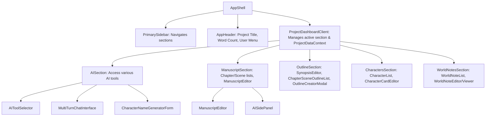
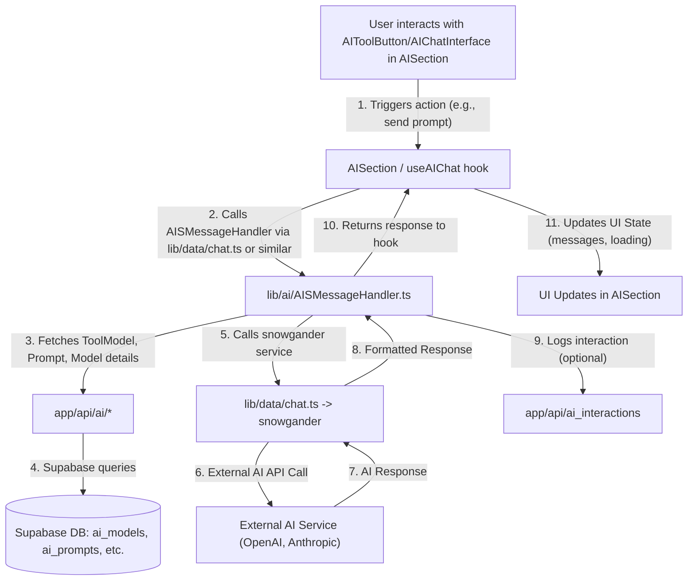

```
├── app/
│   ├── (auth)/                 # Auth routes (login, register, password handling)
│   ├── (dashboard)/            # Main application routes after login
│   │   ├── project/[projectId]/ # Specific project dashboard
│   │   └── settings/            # Application/AI settings
│   ├── api/                    # Backend API routes (data access, AI interactions)
│   │   ├── ai/                  # AI specific: models, vendors, prompts, tool-models
│   │   └── projects/[projectId]/ # Project-specific data (chapters, scenes, chars, etc.)
│   └── page.tsx                # Homepage
├── components/
│   ├── ai/                     # AI interaction components (AIChatInterface, AISidePanel, AITool*, MarkdownComponent)
│   ├── auth/                   # Auth UI (AuthForm, UserMenuButton)
│   ├── characters/             # Character list, creation modal
│   ├── dashboard/
│   │   └── sections/           # Modular dashboard sections (Manuscript, Outline, Characters, WorldNotes, AISection)
│   ├── editors/                # Content editors (ManuscriptEditor, CharacterCardEditor, NoteEditor)
│   ├── homepage/               # Homepage components (ProjectList, ProjectCard)
│   ├── layouts/                # Core layout components (AppShell, AppHeader, Sidebars)
│   ├── manuscript/             # Chapter/Scene list, creation modals, metadata panel
│   ├── modals/                 # Shared modal components (ManageSceneCharactersModal, etc.)
│   ├── outline/                # Outline-specific UI (SynopsisEditor, ChapterSceneOutlineList, OutlineCreatorModal)
│   ├── projects/               # Project creation/editing modals
│   ├── settings/               # Settings UI (modals for AI configs, item lists)
│   ├── ui/                     # Reusable base UI elements (Button, Input, Modal, etc. - CVA often used)
│   └── world-notes/            # World note list, editor, viewer, creation modal
├── contexts/                   # React Context providers (e.g., ProjectDataContext)
├── hooks/
│   ├── ai/                     # Custom hooks for AI features (e.g., useAIChat)
│   └── dashboard/              # Custom hooks for dashboard section data management
├── lib/
│   ├── ai/                     # Core AI logic (AISMessageHandler, outlineCreator, contextFormatters, constants)
│   ├── data/                   # Data access layer (functions calling internal APIs for Supabase)
│   ├── schemas/                # Zod schemas for validation (API inputs, forms)
│   ├── supabase/               # Supabase client setup, middleware, RLS guards, DB types
│   ├── types/                  # Core TypeScript types (index.ts, ai.ts)
│   └── utils.ts                # General utility functions (cn, countWords, etc.)
├── public/                     # Static assets
└── supabase/                   # Supabase local development (migrations, seed.sql)
```

## Key Technical Decisions & Patterns

1.  **Server Components by Default (Next.js App Router):** Enhances performance and SEO. Client Components (`"use client"`) used for interactivity.
2.  **TypeScript & Zod:** Strict typing enforced. Zod schemas in `lib/schemas/` for API/form validation and type inference.
3.  **Modular Dashboard Architecture:**
    - Project dashboard sections (`components/dashboard/sections/`) are self-contained React components.
    - Each section uses a custom data hook (`hooks/dashboard/`) for its data, state, and logic.
    - `ProjectDataContext` (`contexts/ProjectDataContext.tsx`) provides shared project-wide data (e.g., all characters, scene tags) to sections.
    - `ProjectDashboardClient.tsx` acts as a shell, rendering the active section and providing context.
4.  **Data Access Layer (`lib/data/`):** Functions in this directory abstract calls to internal Next.js API routes (`app/api/`). These routes then interact with Supabase. This pattern is used by both Server and Client Components. Cookie forwarding is handled for authenticated internal API calls.
5.  **AI Integration (`lib/ai/`, `snowgander`):**
    - `AISMessageHandler.ts`: Central orchestrator for AI tool requests. Formats context, retrieves prompts/models, calls `snowgander`.
    - `snowgander` package: Vendor-agnostic AI API connectivity.
    - `tool_model` table: Maps abstract tool names (e.g., `log_line_generator`) to specific `ai_models`.
    - `ai_prompts` table: Stores system prompts, fetched by `AISMessageHandler`.
    - `lib/ai/contextFormatters.ts`: Prepares project-specific context for different AI tools.
    - UI: `AISection/`, `AISidePanel.tsx`, `AIToolButton.tsx`, `useAIChat.ts`.
6.  **Outline Creator (`lib/ai/outlineCreator.ts`):**
    - AI generates a JSON representation of a novel outline based on a synopsis.
    - Uses `outline_json_generator` tool via `AISMessageHandler`.
    - Strict TypeScript interfaces (`ParsedOutlineData` in `lib/types/ai.ts`) and Zod schemas (implicitly) for JSON validation.
    - Two-phase process: 1) AI generation & parsing (`generateAndParseOutline`), 2) DB entity creation (`createEntitiesFromOutline`).
7.  **View/Edit Toggle for Notes (`WorldNotesSection`, `WorldNoteViewer.tsx`, `WorldNoteEditor.tsx`):**
    - Content defaults to a static, Markdown-rendered view (`WorldNoteViewer`).
    - "Edit" button toggles to an editor (`WorldNoteEditor`). State managed in `useWorldNotesData`.
    - Improves UX by preventing accidental edits and providing a clean read view.
8.  **Authentication (`@supabase/ssr`):** Server-side session management with cookie handling. Middleware protects routes. `verifyProjectOwnership` guard in `lib/supabase/guards.ts` secures project-specific API routes.
9.  **Two-Tiered Scene Tagging:**

    - `scenes.primary_category`: An ENUM (`primary_scene_category_enum`) for main classification.
    - `scene_applied_tags` (join table): Links scenes to multiple global/project-specific tags from `scene_tags` table.

    ## Component Relationships (High-Level Dashboard)



## Data Flow (Client-Side Example for AI Tool)


