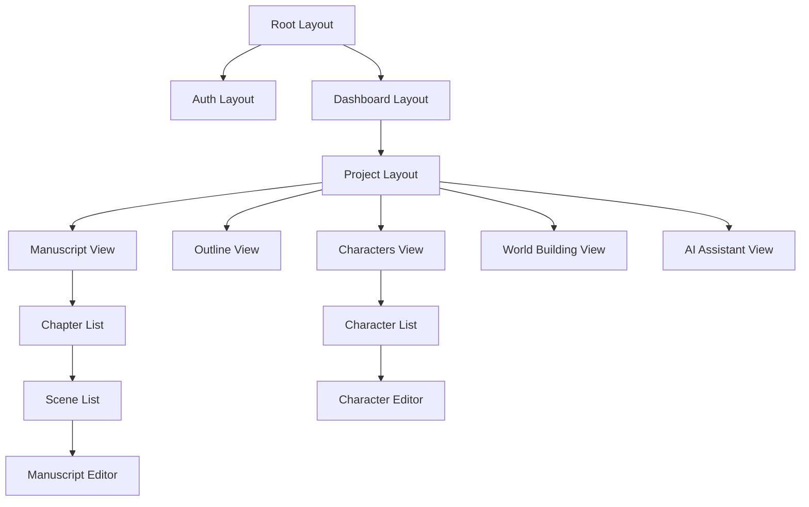
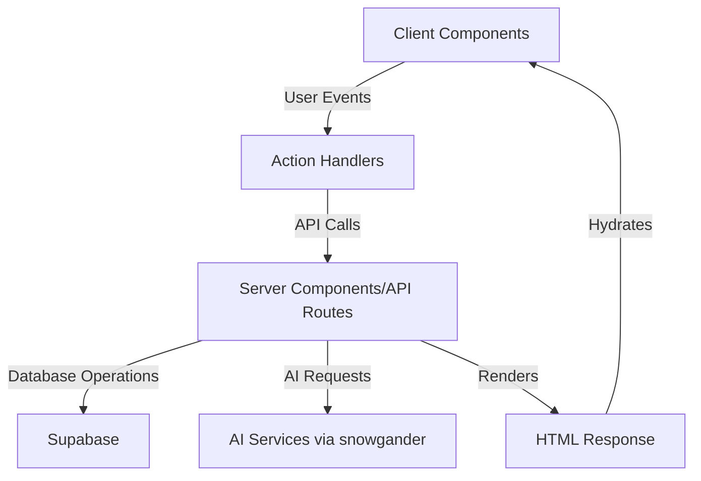

# System Patterns

## System Architecture

Snowscribe follows a modern web application architecture using Next.js 15+ with the App Router pattern:

```
├── app/                    # Next.js App Router structure
│   ├── (auth)/             # Authentication routes (grouped)
│   ├── (dashboard)/        # Dashboard routes (grouped)
│   ├── api/                # API routes
│   ├── globals.css         # Global styles
│   └── layout.tsx          # Root layout
├── components/             # React components
│   ├── ui/                 # Reusable UI components
│   ├── forms/              # Form-related components
│   ├── layouts/            # Layout components
│   └── [feature]/          # Feature-specific components
├── lib/                    # Shared utilities
│   ├── supabase/           # Supabase client and helpers
│   ├── utils/              # General utilities
│   ├── schemas/            # zod schemas
│   ├── data/               # Data access layer to abstract supabase API calls
│   └── types/              # TypeScript types and interfaces
├── hooks/                  # Custom React hooks
├── middleware.ts           # Next.js middleware
└── public/                 # Static assets
```

## Key Technical Decisions

1. **Server Components by Default**: Using React Server Components for improved performance, SEO, and reduced client-side JavaScript.
2. **Client Components When Necessary**: Adding `"use client"` directive only for components that require interactivity, hooks, or browser APIs.
3. **Strong Type System**: Strict TypeScript typing for all components, functions, and data structures.
4. **Component-Driven Design**: Building a library of reusable, single-responsibility UI components.
5. **Supabase for Backend Services**: Using Supabase for authentication, database, and storage needs.
6. **AI Integration via snowgander**: Building an in-house package for vendor-agnostic AI API connectivity.

## Design Patterns

### Component Design Pattern

- Using the **Variant Pattern** with `class-variance-authority` (CVA) for creating flexible, variant-driven UI components
- Following the **Single Responsibility Principle** (SRP) for all components
- Implementing **Atomic Design** methodology: atoms, molecules, organisms, templates, and pages

### State Management Pattern

- **Server-First State Management**: Keeping as much state as possible on the server
- **Local Component State**: Using React's useState for component-specific state
- **Global Client State**: For client-only state that needs to be shared

### Data Fetching Pattern

- **Server Component Data Fetching**: Direct data fetching in Server Components without client-side fetching
- **React Query/SWR**: For client-side data fetching with caching and revalidation when needed

### Authentication Pattern

- **Core**: Utilizes Supabase Auth for user authentication with server-side session handling (via `@supabase/ssr` and cookie management).
- **Route Protection**:
  - **Middleware**: `middleware.ts` is used for protecting pages/routes by validating user sessions. Unauthenticated users are redirected to login for protected areas.
  - **API Route Authorization**:
    - All API routes begin by verifying the authenticated user via `supabase.auth.getUser()`.
    - For routes operating on project-specific data (e.g., `/api/projects/[projectId]/...`), the `verifyProjectOwnership` guard from `lib/supabase/guards.ts` is called immediately after user authentication to ensure the user owns the specified project. This provides a centralized and explicit check before any further processing.
    - Subsequent database queries for sub-resources (chapters, scenes, etc.) within a verified project context will also typically include checks against `project_id` to ensure data integrity.
- **Database Level Security**:
  - **Row Level Security (RLS)**: Supabase RLS policies are crucial for enforcing data access rules at the database level, ensuring users can only access or modify data they own or are permitted to see (e.g., based on `user_id` in the `projects` table and linked tables). The application-level guards complement RLS by providing earlier checks and clearer error handling in the API layer.

### Data Management and Validation Patterns

- **Entity-Specific Zod Schemas (`lib/schemas`)**: Each core data entity has a corresponding Zod schema file (e.g., `project.schema.ts`). This pattern centralizes validation logic, ensures data integrity at API boundaries, and facilitates type inference for consistent data handling.
- **Centralized Data Access Layer (`lib/data`)**: Server-side functions for database interactions are grouped in the `lib/data` directory (e.g., `projects.ts`, `chapters.ts`). This abstracts direct Supabase calls, promotes reusability in Server Components and API Routes, and enhances separation of concerns.
- **Project Ownership Verification Guard (`lib/supabase/guards.ts`)**: A utility function, `verifyProjectOwnership` located in `lib/supabase/guards.ts`, centralizes the logic for checking if a project (and by extension, its sub-resources) belongs to the authenticated user. This guard is used at the beginning of API route handlers that operate on project-specific data to ensure authorization before proceeding. It complements RLS by providing an explicit, application-level check early in the request lifecycle.

## Component Relationships

### Core Component Structure



### Data Flow



## Critical Implementation Paths

### Authentication Flow

1. User signs in via Supabase Auth
2. Session is stored in cookies
3. Middleware validates session on protected routes
4. User is redirected to login if session is invalid

### Project Creation and Management

1. User creates a new project with basic metadata
2. Project structure (chapters, scenes) is initialized in database
3. User navigates between project sections via sidebar navigation
4. All changes are persisted to Supabase in real-time

### AI Integration Points

1. AI features are accessible throughout the app but can be hidden when not in use
2. Each AI tool (Snowflake Outliner, Character Enhancer, etc.) has its own specialized system prompt
3. AI usage is tracked and limited based on subscription tier
4. User can select preferred AI model via snowgander package
